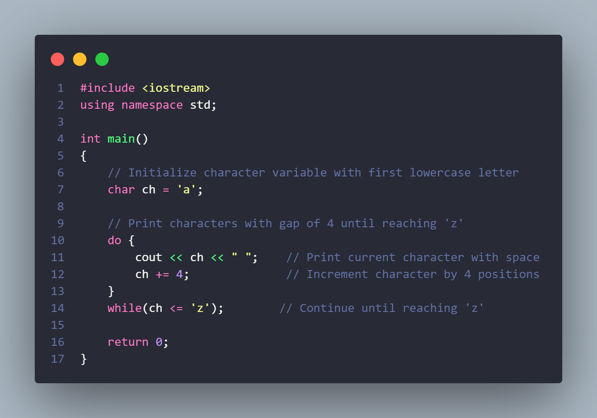
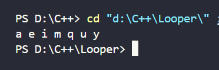
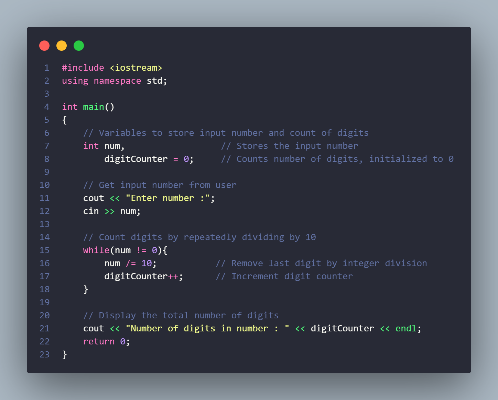
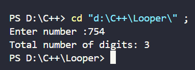
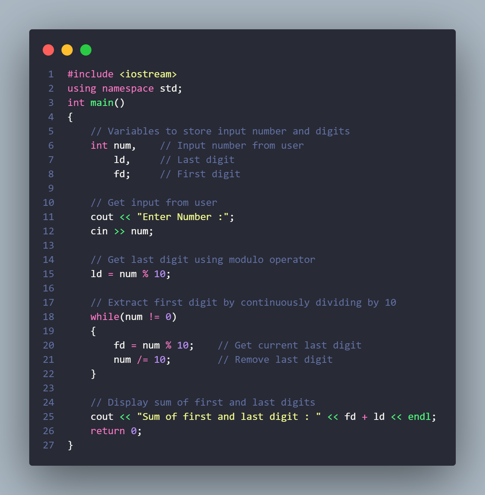
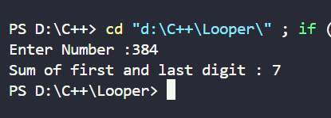

<h3>Q-1 : Alphabet Skipper</h3>

Develop the program that print all alphabet from 'a' to 'z'  by skipping 3 alphabet.

<h2>Input :</h2>

 
<h2>Output :</h2>

<h3>Q.2 Digit Counter </h3>

Develop a Program to count the total number of digits in a number. 

<h2>Input :</h2>

 
<h2>Output :</h2>

<h3>Q.3 Digit Addition </h3>

Develop a Program to find the sum of a number's first and last digits. 

<h2>Input :</h2>

 
<h2>Output :</h2>

